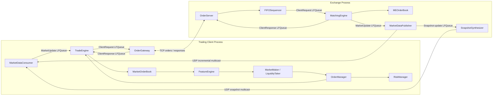

# Low-Latency Trading System

这是一个基于现代 C++20 的教学型低延迟交易系统，包含交易所撮合、订单接入、增量行情、快照恢复、
交易策略、风控和订单管理等组件。本仓库在原始教学代码基础上，重点扩展了**性能测量正确性、可复现
benchmark、非阻塞 TCP 稳健性和源码级技术文档**。

> 本项目用于低延迟系统学习和性能工程实验，不是生产级交易所，也不连接真实资金账户。README 中
> 的延迟数据来自单机阿里云 KVM 环境；除特别说明外，不代表物理网络或真实交易所延迟。

## 项目亮点

- Exchange 与 Trading Client 分进程运行，组件之间通过预分配 LFQueue 传递固定结构消息；
- 订单通道使用 non-blocking TCP，行情通道使用 UDP multicast；
- 撮合订单簿支持价格优先、同价 FIFO、ADD/CANCEL、部分成交、完全成交和多档扫单；
- 增量行情使用连续 sequence number 检测缺口，并通过周期性 snapshot 恢复本地订单簿；
- 使用内存池、直接索引数组、侵入式双向链表、整数价格和异步日志降低 hot-path 开销；
- 新增经过序列化、频率校准、measurement-overhead 修正和 CPU migration 检测的 TSC 计时框架；
- 新增 Matching Engine、策略 tick-to-first-order、application Tick-to-Kernel-Send 和 TCP loopback
  Order RTT 四组正式 benchmark；
- hot path 仅写入预分配的原始 latency 数组，测试结束后离线统计 P50/P90/P95/P99/P99.9。

## 架构



默认网络配置位于 `exchange/exchange_main.cpp` 和 `trading/trading_main.cpp`：

| 通道 | 协议 | 地址 | 用途 |
|---|---|---|---|
| Order entry | TCP | `127.0.0.1:12345` | NEW/CANCEL 与 ACCEPTED/FILLED/CANCELED 响应 |
| Incremental market data | UDP multicast | `233.252.14.3:20001` | 实时 ADD/MODIFY/CANCEL/TRADE |
| Snapshot market data | UDP multicast | `233.252.14.1:20000` | 增量行情丢包后的订单簿恢复 |

默认使用 Linux loopback 接口 `lo`，所以数据经过本机内核网络栈，但不经过物理 NIC 或交换机。

## 关键数据链路

### 订单请求与响应

```text
MarketDataConsumer
  -> TradeEngine
  -> MarketOrderBook / FeatureEngine / Strategy
  -> RiskManager / OrderManager
  -> ClientRequest LFQueue
  -> OrderGateway
  -> TCP loopback
  -> OrderServer
  -> FIFOSequencer
  -> MatchingEngine
  -> MEOrderBook
  -> ClientResponse LFQueue
  -> OrderServer
  -> TCP loopback
  -> OrderGateway
  -> TradeEngine
```

### 增量行情与快照

```text
MEOrderBook produces ADD / MODIFY / CANCEL / TRADE
  -> MatchingEngine::sendMarketUpdate()
  -> MarketUpdate LFQueue commit
  -> MarketDataPublisher::run()
  -> append incremental sequence
  -> McastSocket outbound buffer
  -> UDP incremental multicast
  -> MarketDataConsumer sequence validation
  -> TradeEngine local MarketOrderBook

The same sequenced update
  -> snapshot_md_updates_ LFQueue
  -> SnapshotSynthesizer maintains a live-order replica
  -> periodic SNAPSHOT_START / CLEAR / ADD... / SNAPSHOT_END
  -> UDP snapshot multicast
```

`MarketDataPublisher` 和 `SnapshotSynthesizer` 是两个独立线程，分别拥有 incremental socket 和
snapshot socket。它们没有共享同一个用户态发送缓冲区，但会竞争 CPU、内核网络栈和网卡资源。

## 核心组件

| 组件 | 主要源码 | 作用 |
|---|---|---|
| `OrderServer` | `exchange/order_server/` | 接受 TCP client、解析订单、校验应用 sequence、发送响应 |
| `FIFOSequencer` | `exchange/order_server/fifo_sequencer.h` | 按接收时间对多个 client 请求排序并提交给 MatchingEngine |
| `MatchingEngine` | `exchange/matcher/matching_engine.*` | 按 ticker 路由 NEW/CANCEL，输出 client response 和 market update |
| `MEOrderBook` | `exchange/matcher/me_order_book.*` | 价格优先、同价 FIFO 的撮合订单簿 |
| `MarketDataPublisher` | `exchange/market_data/market_data_publisher.*` | 为增量行情编号、批量写入 UDP buffer，并转发给快照线程 |
| `SnapshotSynthesizer` | `exchange/market_data/snapshot_synthesizer.*` | 维护存活订单副本并周期性发布完整 snapshot |
| `MarketDataConsumer` | `trading/market_data/` | 接收增量/快照行情、发现 sequence gap 并执行恢复 |
| `TradeEngine` | `trading/strategy/trade_engine.*` | 驱动本地订单簿、特征、策略、持仓、风控和订单管理 |
| `OrderGateway` | `trading/order_gw/` | 从 TradeEngine 消费订单，通过 TCP 与 OrderServer 通信 |
| `TCPSocket/TCPServer` | `common/tcp_socket.*`, `common/tcp_server.*` | non-blocking TCP、用户态收发缓冲、partial-write 处理与 epoll |
| `McastSocket` | `common/mcast_socket.*` | UDP multicast publisher/subscriber 封装 |
| `LFQueue` | `common/lf_queue.h` | 预分配的单生产者/单消费者风格环形队列 |
| `MemPool` | `common/mem_pool.h` | 预分配固定对象，避免订单簿 hot path 动态分配 |

## 本仓库的扩展工作

原始 Chapter 12 教学代码提供 Exchange、Trading Client、订单簿、网络和策略主体。本仓库新增或
重构的性能工程工作包括：

1. **TSC 测量框架**
   - 新增 `common/tsc_clock.h` 与 `common/latency_recorder.h`；
   - 使用 `LFENCE; RDTSCP; LFENCE` 限制测量边界附近的指令重排；
   - 使用 `TSC_AUX` 检测样本期间的 CPU migration；
   - 启动时相对 `CLOCK_MONOTONIC_RAW` 动态校准 TSC frequency；
   - 每次运行独立测量 empty timestamp-pair overhead；
   - 正式 benchmark hot path 不进行动态分配、日志格式化、文件 I/O 或 percentile 排序；另提供
     独立 T0–T6 诊断 target，不把额外时间戳混入正式结果。

2. **可复现业务 benchmark**
   - `matching_latency_benchmark`：ADD、CANCEL、单档完全成交、四档 sweep；
   - `tick_to_trade_benchmark`：已解码行情到第一笔策略订单完成 LFQueue commit；
   - `tick_to_kernel_send_benchmark`：UDP `recv()` 返回到完整 TCP outbound buffer 被内核接受；
   - `order_rtt_benchmark`：OrderGateway 首次成功内核 send 到对应 response 被验证；
   - 支持 warm-up、CPU affinity、原始 samples、metadata 和离线分位数统计。

3. **非阻塞 TCP 与线程生命周期修正**
   - 保留 partial write 后尚未发送的字节；
   - `EINTR` 重试，`EAGAIN/EWOULDBLOCK` 时不清空 outbound buffer；
   - TCP 分帧后的重叠搬移改用 `memmove`；
   - benchmark 组件使用 atomic run flag、显式 join 和线程绑核。

4. **源码级复习文档**
   - 记录 Exchange/Trading 架构、订单簿数据结构、hot path、socket、内存和 benchmark 边界；
   - 明确区分实测结果、教学项目局限与尚未测量的指标。

上游自带的 `hash_benchmark.cpp`、`logger_benchmark.cpp` 和 `release_benchmark.cpp` 仍保留为教学
对照；正式简历数据优先使用本仓库新增的四组业务 benchmark。

## Benchmark 方法

正式 benchmark 统一采用：

- Release build：`-O3 -DNDEBUG`；
- 固定 CPU 或为组件分配不同物理 core；
- 每个场景 100,000 次 warm-up；
- 每轮每场景 1,000,000 个有效样本；
- 五轮独立运行，表格报告“五轮各自统计值的中位数”，不挑最好的一轮；
- TSC frequency 每次启动动态校准，扣除本轮时间戳开销；
- 拒绝发生 CPU migration 或 TSC 倒退的样本；
- 原始 ticks 写入预分配数组，CSV 和 percentile 在测试结束后生成；
- 不删除 outlier，同时报告 min、max 和 standard deviation。

离线统计脚本 `scripts/summarize_latency.py` 输出：

```text
sample count, mean, median/P50, P90, P95, P99, P99.9,
min, max, population standard deviation
```

## Baseline 结果

测试日期：2026-09-01。测试环境：阿里云 KVM，Intel Xeon 6982P-C，guest 可见 16 个逻辑 CPU
（8 个物理 core、每 core 2 个 SMT thread），GCC 11.4.0，CMake 3.22.1，Release `-O3
-DNDEBUG`，校准 TSC 约 2.8 GHz。

| Benchmark | Scenario | Samples | P50 | P99 | P99.9 | Unit |
|---|---|---:|---:|---:|---:|---|
| Matching Engine | ADD | 5 × 1,000,000 | 77.14 | 104.29 | 120.71 | ns |
| Matching Engine | CANCEL | 5 × 1,000,000 | 95.00 | 106.43 | 128.57 | ns |
| Matching Engine | match one level | 5 × 1,000,000 | 134.29 | 169.29 | 193.57 | ns |
| Matching Engine | sweep four levels | 5 × 1,000,000 | 478.57 | 547.86 | 798.57 | ns |
| Strategy response | maker book update → first order | 5 × 1,000,000 | 45.00 | 47.86 | 62.14 | ns |
| Strategy response | taker trade → first order | 5 × 1,000,000 | 41.43 | 44.29 | 47.86 | ns |
| Application Tick-to-Kernel-Send | UDP recv complete → TCP buffer drained | 5 × 1,000,000 | 3.068 | 3.810 | 7.463 | µs |
| Order RTT | NEW → ACCEPTED | 5 × 1,000,000 | 7.386 | 11.020 | 14.793 | µs |
| Order RTT | CANCEL → CANCELED | 5 × 1,000,000 | 7.391 | 11.013 | 14.889 | µs |

总计记录 51,000,000 个样本（包含 1,000,000 个 TSC 框架自检样本，以及 Application
Tick-to-Kernel-Send 优化前后各 5,000,000 个样本）。正式轮次均无 invalid/dropped/protocol
error；使用 TSC 的轮次还记录：

```text
migration_samples = 0
invalid_samples   = 0
dropped_samples   = 0
```

完整环境、五轮范围、mean/min/max/stddev 和原始测量解释见
[`benchmarks/PERFORMANCE_BENCHMARK_REPORT.md`](benchmarks/PERFORMANCE_BENCHMARK_REPORT.md)。

### 必须同时阅读的测量边界

| 指标 | 起点 | 终点 | 明确不包含 |
|---|---|---|---|
| Matching Engine | 调用 `processClientRequest()` 前 | 函数返回后 | TCP、OrderServer、FIFO、request queue wait |
| Strategy response | TradeEngine 开始处理一条已解码 update | 第一笔订单完成 LFQueue commit | UDP 接收/解码、OrderGateway、TCP send |
| Application Tick-to-Kernel-Send | MarketDataConsumer 的 UDP `recv()` 返回 | OrderGateway 完整 pending TCP buffer 被内核接受 | 入站 recv syscall、物理 NIC/wire、交易所 |
| Order RTT | OrderGateway 首次成功的内核 `send()` 前 | 收到并验证对应 response | 物理 NIC、跨机网络、TradeEngine、饱和排队 |

Matching 与策略测试使用 reduced-capacity、warm-cache、同步 harness。Order RTT 使用 TCP loopback、
单 outstanding request 和四个不同物理 core。特别地，NEW RTT 终点是 `ACCEPTED` response；源码中
该 response 可能早于完整 `addOrder()` 完成，因此不能将其表述为完整订单簿插入延迟。

## 构建环境

推荐 Linux x86-64：

```text
GCC 11+
CMake 3.22+
Ninja
Python 3
```

项目依赖 Linux 的 epoll、pthread affinity、`taskset` 和 multicast socket 行为；macOS 可以用于阅读
和编辑，但不能直接按当前配置完成全部构建和正式低延迟测试。

安装 Ubuntu 依赖：

```bash
sudo apt update
sudo apt install -y build-essential cmake ninja-build python3
```

构建 Release 和 Debug：

```bash
bash scripts/build.sh
```

只构建 Release：

```bash
cmake -S . -B cmake-build-release \
  -G Ninja \
  -DCMAKE_BUILD_TYPE=Release

cmake --build cmake-build-release -j 4
```

检查正式 benchmark 是否包含 `-O3 -DNDEBUG`：

```bash
ninja -C cmake-build-release -t commands matching_latency_benchmark \
  | grep -E -- '-O3|-DNDEBUG'
```

## 运行完整教学系统

默认脚本启动：

- 1 个 exchange；
- client 1：`MAKER`；
- client 5：`RANDOM`；
- 其余示例 client 在 `scripts/run_clients.sh` 中默认注释。

```bash
bash scripts/run_exchange_and_clients.sh
```

也可以分别启动：

```bash
./cmake-build-release/exchange_main

./cmake-build-release/trading_main 5 RANDOM
```

`MAKER`/`TAKER` 的命令行格式：

```text
trading_main CLIENT_ID ALGO_TYPE \
  [CLIP THRESHOLD MAX_ORDER_SIZE MAX_POSITION MAX_LOSS] ...
```

每组五个参数对应一个 ticker。完整示例见 `scripts/run_clients.sh`。

> 默认生产配置包含大型直接索引数组、LFQueue 和每 socket 64 MiB inbound + 64 MiB outbound 用户态
> buffer。4 GB VM 可能因 OOM 被系统直接 `Killed`；不要用默认多 client 配置进行低内存压力测试。

## 运行 Benchmark

### 1. TSC 框架自检

```bash
bash scripts/run_tsc_benchmark.sh \
  2 1000000 runs/tsc_latency.csv

cat runs/tsc_latency.csv.summary.txt
```

参数依次为：逻辑 CPU、sample 数量、输出 CSV。

### 2. Matching Engine / OrderBook

```bash
bash scripts/run_matching_benchmark.sh \
  2 1000000 runs/matching-run-01

cat runs/matching-run-01/matching_add.summary.txt
cat runs/matching-run-01/matching_cancel.summary.txt
cat runs/matching-run-01/matching_match_one.summary.txt
cat runs/matching-run-01/matching_sweep4.summary.txt
```

参数依次为：逻辑 CPU、每场景 sample 数量、输出目录。

### 3. Strategy tick-to-first-order

```bash
bash scripts/run_tick_to_trade_benchmark.sh \
  2 1000000 runs/ttt-run-01

cat runs/ttt-run-01/ttt_maker_book_to_first_order.summary.txt
cat runs/ttt-run-01/ttt_taker_trade_to_order.summary.txt
```

参数依次为：逻辑 CPU、每场景 sample 数量、输出目录。

### 4. TCP loopback Order RTT

先用以下命令确认逻辑 CPU 与物理 core 的对应关系：

```bash
lscpu -e=CPU,CORE,SOCKET,NODE,ONLINE
```

再选择四个不同的物理 core：

```bash
WARMUP=100000 bash scripts/run_order_rtt_benchmark.sh \
  2 4 6 8 1000000 runs/order-rtt-run-01

cat runs/order-rtt-run-01/order_rtt_new.summary.txt
cat runs/order-rtt-run-01/order_rtt_cancel.summary.txt
```

参数依次为：benchmark main CPU、OrderGateway CPU、OrderServer CPU、MatchingEngine CPU、每场景
sample 数量、输出目录和可选 TCP port。脚本会拒绝重复 CPU，以及能从 `lscpu` 识别出的 SMT sibling
冲突。

### 5. Application Tick-to-Kernel-Send

选择五个不同物理 core：

```bash
WARMUP=100000 bash scripts/run_tick_to_kernel_send_benchmark.sh \
  0 2 4 6 8 1000000 runs/tks-optimized-run-01 \
  19131 22131 22130

cat runs/tks-optimized-run-01/tick_to_kernel_send.summary.txt
```

参数依次为 main、MarketDataConsumer、TradeEngine、OrderGateway、TCP sink CPU，样本数、输出
目录、order TCP port、incremental UDP port 和 snapshot UDP port。这一指标使用跨线程稳定的
`CLOCK_MONOTONIC_RAW`，而不是用 TSC_AUX 把不同固定 CPU 误判为 migration。

需要定位阶段瓶颈时使用独立诊断脚本：

```bash
WARMUP=10000 bash scripts/run_tick_to_kernel_send_stage_benchmark.sh \
  0 2 4 6 8 100000 runs/tks-stage-run-01 \
  19151 22151 22150
```

它会额外生成 `tick_to_kernel_send_stages.csv` 以及六个阶段和 total 的独立 summary；该结果只用于
定位，不替代无额外分段时间戳的正式 latency。

## 项目目录

```text
.
├── common/       # queue、memory pool、logging、socket、thread、TSC
├── exchange/     # OrderServer、FIFOSequencer、MatchingEngine、market data
├── trading/      # MarketDataConsumer、TradeEngine、strategy、OrderGateway
├── benchmarks/   # benchmark source、专项说明和完整分析报告
├── scripts/      # build、运行、采样和离线统计脚本
└── notebooks/    # 上游性能分析 notebook
```

不应提交的本地产物包括 `build/`、`cmake-build-*`、`runs/`、`perf_analysis.html`、日志和缓存文件；
这些都由 `.gitignore` 排除，可以通过脚本重新生成。

详细阅读顺序：

1. [性能测试总报告](benchmarks/PERFORMANCE_BENCHMARK_REPORT.md)
2. [Exchange 架构](benchmarks/EXCHANGE_ARCHITECTURE_REVIEW.md)
3. [Trading 架构](benchmarks/TRADING_ARCHITECTURE_REVIEW.md)
4. [订单簿数据结构](benchmarks/ORDER_BOOK_DATA_STRUCTURES_REVIEW.md)
5. [Socket/TCP/UDP multicast](benchmarks/NETWORK_SOCKET_IMPLEMENTATION_REVIEW.md)
6. [低延迟设计与 hot path](benchmarks/LOW_LATENCY_DESIGN_AND_HOT_PATH_REVIEW.md)
7. [Matching benchmark](benchmarks/MATCHING_BENCHMARK.md)
8. [Tick-to-Trade benchmark](benchmarks/TICK_TO_TRADE_BENCHMARK.md)
9. [Order RTT benchmark](benchmarks/ORDER_RTT_BENCHMARK.md)
10. [Application Tick-to-Kernel-Send benchmark](benchmarks/TICK_TO_KERNEL_SEND_BENCHMARK.md)

## 已知限制

- 教学项目，不具备生产交易系统完整的会话登录、heartbeat、reconnect 和 replay；
- wire message 直接使用 packed C++ struct 和 host byte order，缺少 version/length/checksum；
- accepted TCP socket 没有在源码中显式重新设置 `SO_TIMESTAMP`，正式依赖 FIFO 时间戳前应修复并
  对缺失 `SCM_TIMESTAMP` 计数；
- `LFQueue` 没有完整的 full detection/backpressure，不能直接用于无限制饱和压力测试；
- UDP publisher 没有限制单 datagram 的 update 数量，失败后也缺少完整 retry/drop policy；
- multicast interface 选择不够明确，多网卡环境需要显式设置 membership/interface；
- `TCPServer` 的 EPOLLET、EPOLLOUT、断线清理和 max-events 管理仍需完善；
- 默认数组和 socket buffer 占用很大，不适合 4 GB VM 或大量 client；
- 没有 kernel bypass、zero-copy、DPDK、AF_XDP 或硬件时间戳；
- 当前没有多 client scaling、饱和 offered-load、跨机器 RTT 或真实 NIC benchmark；
- KVM vCPU 会受到宿主机调度、steal time 和虚拟化中断影响，绝对 tail latency 不能等同于裸金属。

因此，本项目当前可以支持“组件 latency 测量与性能工程方法”的结论，不应声称已经达到生产级
HFT 的绝对延迟、容量、可靠性或可扩展性。

## 后续计划

- 增加 OrderBook、matching、FIFO 与 recovery 的自动化正确性测试和 CI；
- 为 LFQueue 增加 bounded full detection、backpressure 与明确的 acquire/release publication；
- 在 accepted socket 上显式启用并验证 receive timestamp；
- 限制 UDP datagram batch，记录 `EAGAIN/ENOBUFS/EMSGSIZE`；
- 将 64 MiB 双向 socket buffer 改为按方向和 workload 可配置，并测量 RSS 与 tail latency；
- 补充 market-data receive/decode、FIFOSequencer 和 tick-to-kernel-send benchmark；
- 在相同 workload 下完成一次单变量 before/after 优化实验。

## 来源与许可证

交易系统主体来自 Packt Publishing 的开源示例：

- [Building Low Latency Applications with C++](https://github.com/PacktPublishing/Building-Low-Latency-Applications-with-CPP)
- 对应目录：[Chapter 12](https://github.com/PacktPublishing/Building-Low-Latency-Applications-with-CPP/tree/main/Chapter12)
- 作者：Sourav Ghosh
- 上游许可证：[MIT License](https://github.com/PacktPublishing/Building-Low-Latency-Applications-with-CPP/blob/main/LICENSE)，Copyright (c) 2022 Packt

学习过程也参考了博客：

- [《12｜基于现代 C++ 完整实现一个低延迟交易系统》](https://nioer.blog.csdn.net/article/details/162448231)

本仓库是教学源码的学习与性能工程扩展，不将上游主体代码表述为个人从零实现。分发派生版本时应
保留上游 MIT License 与版权声明，并在简历和面试中明确区分原始架构与个人新增内容。
